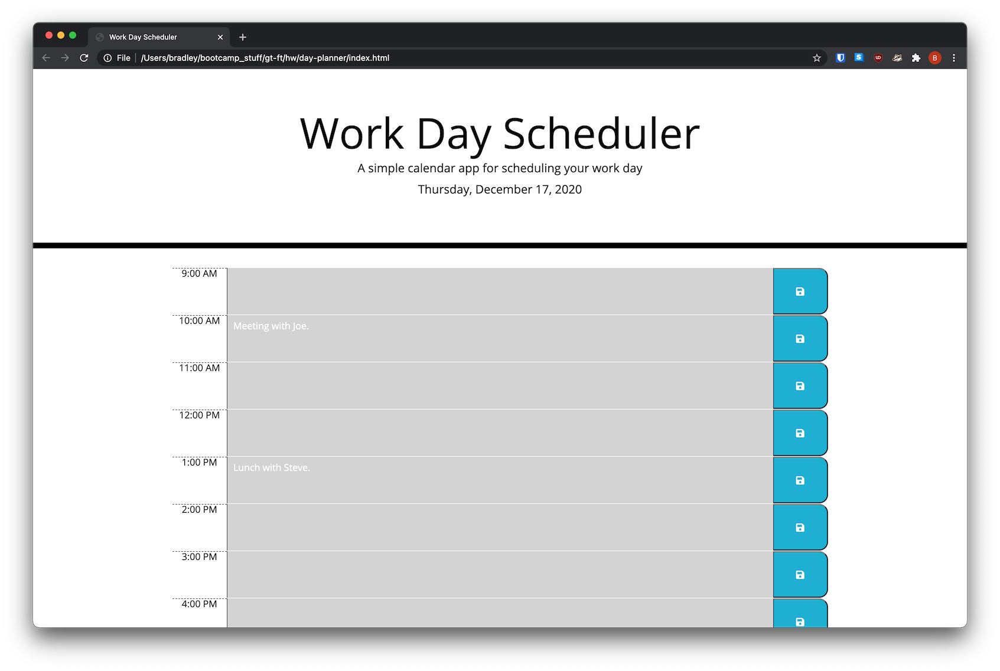

# day-planner

## Description
This is a simple work day planner that allows you to enter and save events for the hours 9am-6pm. Events persist through the use of `localStorage` and `jQuery` is used for DOM manipulation. Check out the [live](https://brhue.github.io/day-planner/) version.
## Installation
Clone the repository to your local machine.
## Usage
Open `index.html` in your favorite browser.
## Credits

## License
MIT